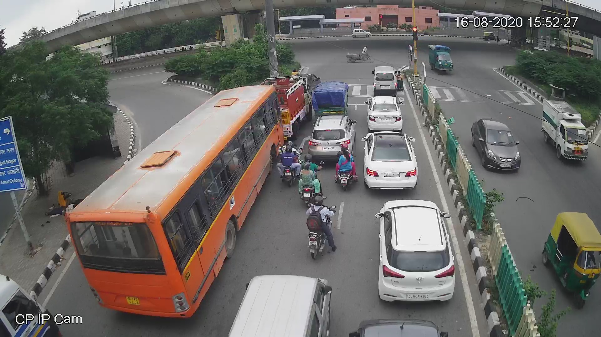
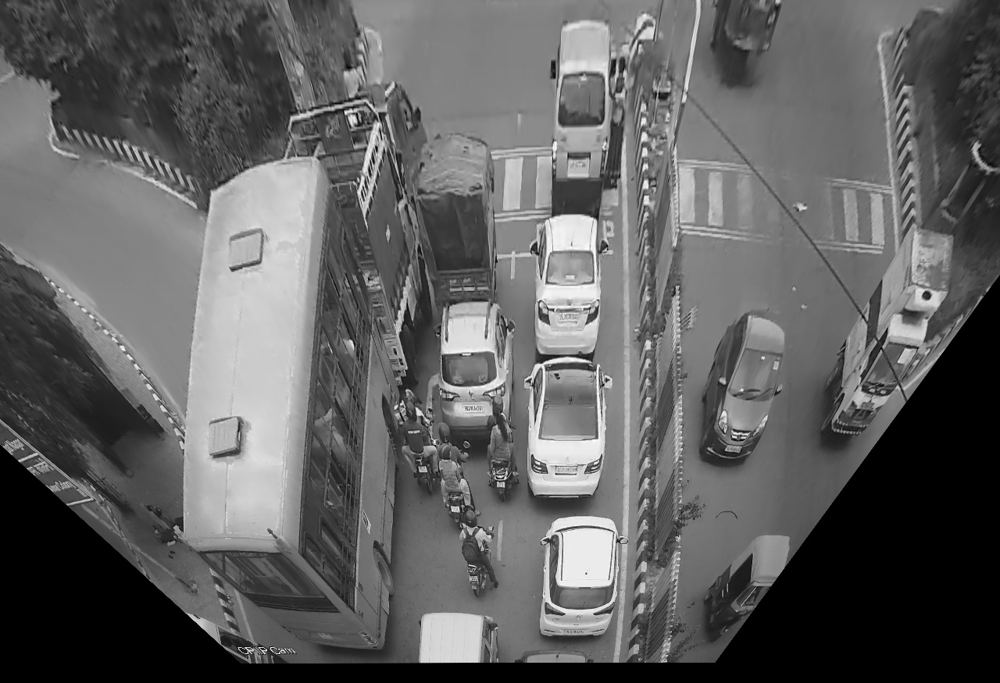
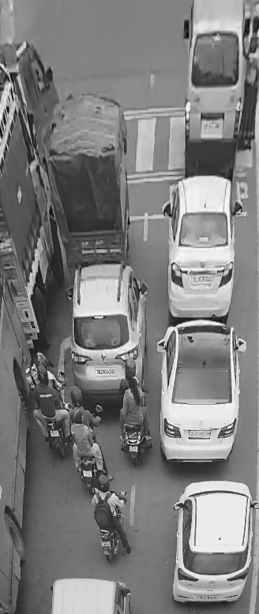
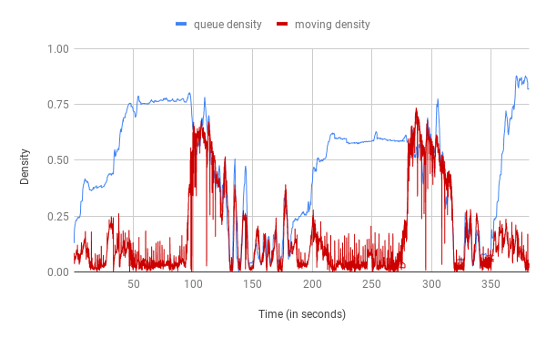

# Traffic Density Estimation

This is a python-based traffic density estimator, works using OpenCV algorithms and functions. Analyses CCTV footage in real time to estimate the density of traffic. Capable of differentiating between idle and moving traffic. Can be used for automatic switching of traffic lights based on traffic density and can even be upgraded to parametrize pedestrian density for higher safety. Please check out the [report](Traffic_Density_Estimation.pdf) for details and analysis.

It has been implemented in three stages. Each stage either adds up features or increases the efficiency of the system. The stages are as follows:

## Stage 1: The basic functions
### Perspective correction and frame cropping

This stage implements the most basic and necessary functions. Typically the camera gets an arbitrary view of the road/intersection to be monitored and also contains many unnecessary additional objects in the frame. This stage corrects the camera angle and crops out the unwanted objects from the frame.

The camera angle correction is based on Homography. A Homography is a transformation ( a 3×3 matrix ) that maps the points in one image to the corresponding points in the other image. It can be used for perspective correction, panoramic stitching and virtual advertisements. For more info on homography, please check [this](https://docs.opencv.org/master/d9/dab/tutorial_homography.html) and [this](https://learnopencv.com/homography-examples-using-opencv-python-c/).

These are the video frames at different substages.

 

   
	Unprocessed initial frame

   
	Perspective corrected

   
	Final post processing frame

 
____

## Stage 2: Estimating traffic density
### Idle (queue) and moving (dynamic) density estimation from video file

This stage takes up frames from the input video, processes them using stage 1 functions, and analyses them to estimate the density of traffic. Idle traffic density is referred to as queue density as they would be queuing at the intersection, and moving traffic density is referred to as dynamic density.

Queue density works using background subtraction. Processed empty frame (no traffic, empty road and intersection) is subtracted from current processed frame to estimate the density of idle traffic.

Dynamic density works on optical flow. It performs optical flow detection across subsequent frames to detect the pixels which moved across frames.

Outputs a graph of both densities with time.

   
	Traffic density vs Time

____

## Stage 3: Understanding and analyzing trade-offs
### Utility-Runtime trade off analysis of four different models/techniques

In estimating traffic density, **accuracy** is not the only metric to optimize. **Latency**, **throughput** are two other metrics to be optimized. Physically, other important metrics are:

1) Temperature of the processor: Temperatures can shoot to 45C and the processor might fry up.
2) Energy usage: The system should be efficient in terms of energy usage.
3) Security: We obviously don't want hackers to break into the software and cause accidents.

Many of these metrics might conflict with each other. Example, for higher throughput, the system will have to run at higher frequency thereby draining more power and heating up more. Another example, putting security checks against hackers might make the code run slower. This aspect of having multiple metrics to optimize, which conflict with each other, is called trade-off.

In this stage, we do a utility-runtime tradeoff analysis for queue density estimation. We have the following different methods/models/parameters:

1) Method1: Sub-sampling frames - Instead of processing each frame of the 15 fps input video, process every **x**th frame.
Parameter : x = number of frames skipped

2) Method2: Resolution reduction - Reduce resolution of input frames. Lower resolution frames will be processed higher but will have higher error.
Parameter : z = **fractional height** * **fractional width**

3) Method3: Spatial multi-threading - Give different parts of the frames to different threads. Parallelized would be faster.
Parameter : x = number of threads

4) Method4: Temporal multi-threading - Different groups of frames (at different time stamps) can be given to different threads for processing.
Parameter : x = number of threads

Please check the pdf [report](Traffic_Density_Estimation.pdf) for our analysis, final conclusions and discussions.

 ____

 ### Execution Instructions

 1. Navigate to the project directory.
 2. Type `make` or `make all` in the terminal.
 3. Run the executable named *final*  by typing `./final <video_file_path>` where `<video_file_path>` is the path to the video file you want to give as input. If   the command line arguments are not input properly, you will get an error message in the console.
 4. Comma separated values of the timestamp (in seconds), queue density, and dynamic density will be output to the terminal, with each row being separated by a newline (and the last row ending with a newline character).

 #### Common Error
 If you see an error which says  `No package 'opencv' found`, it's likely because it is present under the name opencv4 instead of opencv(which is there in the standard installation) in your system. Please correspondingly change the `LIBS` variable in the Makefile and write opencv4 instead of opencv.

 ____

 Course Project | COP290: Design Practices in Computer Science | Prof. Rijurekha Sen | Spring 2021-22.
